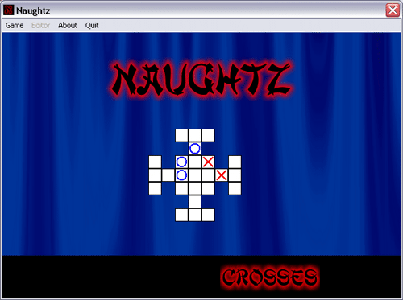



## Naughtz V1\.1

### Description

An update to Naughtz V1. Naughtz is a naughts and crosses game with a difference. Firstly, you can create, load and save your own board layouts. Secondly, there are UFOs which take or place naughts and crosses in random locations (only if you want them to).
 
### More Info
 

             |
---                |---
**Submitted On**   |2001-10-07 16:44:58
**By**             |[Craig Bonathan](https://github.com/Planet-Source-Code/PSCIndex/blob/master/ByAuthor/craig-bonathan.md)
**Level**          |Intermediate
**User Rating**    |5.0 (10 globes from 2 users)
**Compatibility**  |VB 6\.0
**Category**       |[Games](https://github.com/Planet-Source-Code/PSCIndex/blob/master/ByCategory/games__1-38.md)
**World**          |[Visual Basic](https://github.com/Planet-Source-Code/PSCIndex/blob/master/ByWorld/visual-basic.md)
**Archive File**   |[Naughtz\_V1161008752003\.zip](https://github.com/Planet-Source-Code/craig-bonathan-naughtz-v1-1__1-46658/archive/master.zip)

